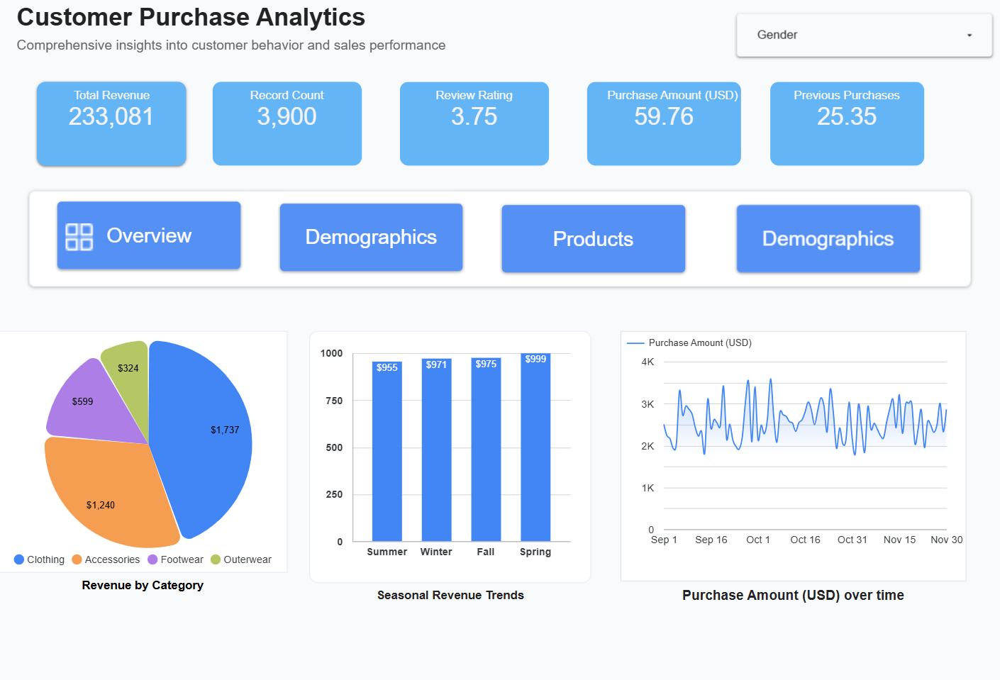

# Customer Purchase Analytics Dashboard

## Overview
This repository contains a comprehensive analysis of consumer behaviour and shopping habits using the [Consumer Behaviour and Shopping Habits Dataset](https://lookerstudio.google.com/reporting/cf2e305f-f5e5-4373-aac1-e9ae5f29f30f) from Kaggle. The analysis provides actionable insights into customer demographics, purchasing patterns, product performance, and operational metrics.

## Dataset Information
- **Source**: Kaggle - Consumer Behaviour and Shopping Habits Dataset
- **Dataset Link**: https://www.kaggle.com/datasets/zeesolver/consumer-behavior-and-shopping-habits-dataset
- **Records**: 3,900 customer transactions
- **Total Revenue**: $233,081
- **Average Purchase Amount**: $59.76
- **Average Review Rating**: 3.75/5
- **Average Previous Purchases**: 25.35

## Key Metrics

### Financial Performance
- **Total Revenue**: $233,081
- **Average Transaction Value**: $59.76
- **Record Count**: 3,900 transactions

### Customer Satisfaction
- **Average Review Rating**: 3.75 out of 5 stars
- **Customer Loyalty**: Average of 25.35 previous purchases per customer

## Analysis Sections

### 1. Overview Dashboard

  
 

Provides high-level metrics and trends, including:
- **Revenue by Category**: 
  - Clothing: $1,737 (44.5%)
  - Accessories: $1,240 (31.8%)
  - Footwear: $599 (15.4%)
  - Outerwear: $324 (8.3%)

- **Seasonal Revenue Trends**: Relatively stable across all seasons
  - Spring: $999
  - Fall: $975
  - Winter: $971
  - Summer: $955

- **Purchase Amount Time Series**: Shows fluctuations between 2K-4K USD over the analyzed period (September - November)

### 2. Demographics Analysis
  
#### Age Distribution
- **55+ age group**: Highest revenue contributor (~$70K)
- **25-34 age group**: Second highest (~$45K)
- **45-54 age group**: ~$45K
- **35-44 age group**: ~$43K
- **18-24 age group**: Lowest contributor (~$29K)

#### Age Distribution Insights
- 55+: 16.00% of customers
- 45-54: 10.00% of customers
- 35-44: 10.00% of customers
- 25-34: 10.00% of customers
- 18-24: 7.00% of customers

#### Gender Distribution
- **Male**: 69% of customer base
- **Female**: 31% of customer base

**Note**: The gender distribution shows a significant skew toward male customers, which may represent a market opportunity for targeting female demographics.

### 3. Product Performance
  
Top performing products by revenue (all approximately $10K-$10.5K):
1. Blouse
2. Shirt
3. Dress
4. Pants
5. Jewellery
6. Sunglasses
7. Belt
8. Scarf
9. Sweater
10. Shorts

**Insight**: Product performance is relatively uniform, suggesting diverse customer preferences without dominant bestsellers.

### 4. Operations Analysis
  
#### Purchase Frequency Revenue
- **Every 3 Months**: $584 (highest)
- **Annually**: $572
- **Quarterly**: $563
- **Monthly**: $553
- **Bi-Weekly**: $547
- **Fortnightly**: $542
- **Weekly**: $539 (lowest)

**Insight**: Customers who purchase every 3 months generate the highest per-transaction revenue, while more frequent purchasers (weekly) have lower transaction values.

#### Payment Method Distribution
- **PayPal**: 17.4%
- **Credit Card**: 17.2%
- **Cash**: 17.2%
- **Debit Card**: 16.3%
- **Venmo**: 16.3%
- **Bank Transfer**: 15.7%

**Insight**: Payment methods are evenly distributed, showing no strong preference. All methods should be maintained for customer convenience.

#### Payment Method by Gender
- **Credit Card**: Most popular overall
  - Male: ~1,700 transactions
  - Female: ~900 transactions
- **PayPal, Cash, Debit Card, Venmo, Bank Transfer**: Similar usage patterns with male customers consistently higher due to overall demographic distribution

#### Shipping Method Usage
All shipping methods show similar usage (~630-675 transactions):
1. Free Shipping: 675
2. Standard: 654
3. Store Pickup: 650
4. Next Day Air: 648
5. Express: 646
6. 2-Day Shipping: 627

**Insight**: Shipping preferences are diverse. Consider optimizing logistics for all methods rather than focusing on a single preferred method.

## Key Insights & Recommendations

### Customer Segmentation
1. **High-Value Segment**: 55+ age group represents the largest revenue opportunity
2. **Growth Opportunity**: Female customers (31%) represent untapped market potential
3. **Loyalty Indicator**: High average of 25.35 previous purchases suggests strong customer retention

### Product Strategy
1. **Diversified Portfolio**: Maintain broad product range as no single category dominates
2. **Seasonal Stability**: Minimal seasonal variation suggests consistent demand year-round
3. **Category Focus**: Clothing and Accessories drive 76% of revenue

### Operational Optimization
1. **Payment Flexibility**: Maintain all payment methods due to even distribution
2. **Shipping Options**: Continue offering diverse shipping methods to meet varied customer needs
3. **Purchase Frequency**: Consider incentivizing 3-month purchase cycles with highest revenue per transaction

### Marketing Opportunities
1. Target female demographic to balance customer base
2. Develop age-specific campaigns for 55+ segment
3. Create loyalty programs for customers with 20+ previous purchases
4. Implement seasonal promotions to boost lower-performing quarters

## Dashboard Features

The analysis includes four interactive dashboard views:
1. **Overview**: Revenue trends, category breakdown, and seasonal patterns
2. **Demographics**: Age and gender distribution analysis
3. **Products**: Product performance and purchase frequency insights
4. **Operations**: Payment methods, shipping preferences, and operational metrics

## Technical Implementation

### Tools & Technologies
- Data visualization and analytics dashboard
- Interactive filtering by Gender and Subscription Status
- Real-time metric calculations
- Responsive chart designs

### Visualizations
- Pie charts for category and payment method distribution
- Bar charts for age groups, seasonal trends, and product performance
- Line charts for time-series purchase amount tracking
- Donut charts for gender and payment method distributions
- Stacked bar charts for gender-based payment preferences

## Data Quality Considerations

- Clean dataset with 3,900 complete records
- Consistent review ratings averaging 3.75/5
- No apparent data quality issues in the analyzed metrics
- Time series data spans approximately 3 months (Sept-Nov)

## Future Analysis Opportunities

1. **Customer Lifetime Value (CLV)**: Calculate CLV based on purchase frequency and average transaction value
2. **Cohort Analysis**: Track customer behavior over time by acquisition cohort
3. **Basket Analysis**: Identify product combinations frequently purchased together
4. **Churn Prediction**: Analyze patterns of customers with declining purchase frequency
5. **Price Elasticity**: Test price sensitivity across different customer segments
6. **Geographic Analysis**: If location data is available, analyze regional preferences
7. **Review Sentiment**: Deep dive into customer reviews to understand satisfaction drivers

## Usage

To replicate this analysis:
1. Download the dataset from [Kaggle](https://www.kaggle.com/datasets/zeesolver/consumer-behavior-and-shopping-habits-dataset)
2. Import into your preferred analytics platform
3. Create calculated fields for key metrics
4. Build visualizations following the dashboard structure
5. Apply filters for interactive exploration

## Contributors

This analysis demonstrates comprehensive retail analytics capabilities, including customer segmentation, product performance tracking, and operational insights.

## License

This analysis is based on the publicly available dataset from Kaggle. Please refer to the original dataset license for usage terms.

---

**Dataset Version**: Consumer Behavior and Shopping Habits Dataset (Kaggle)
